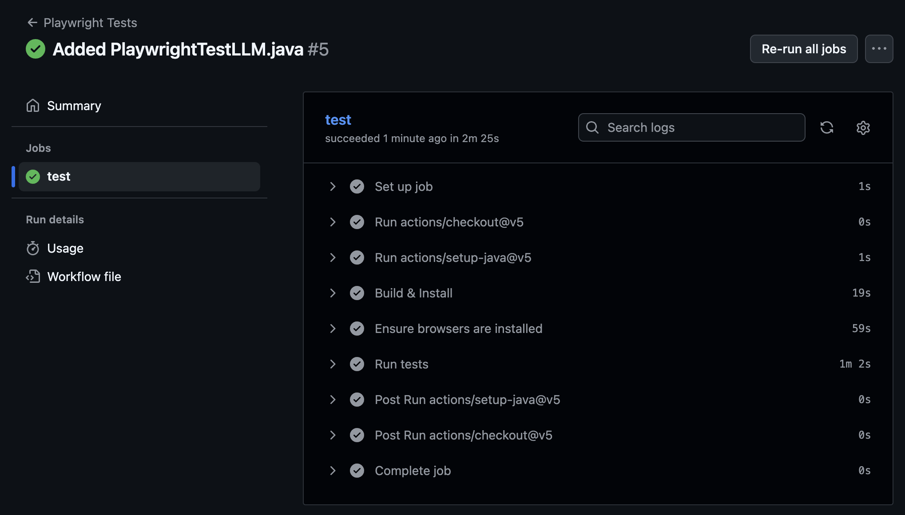

Github Link: https://github.com/amyfan7/se333-playwright

All Actions Passed:

Reflection:
- While the LLM was able to write a working test that's compareable to the manually written UI test, it pulled inspiration from the already written PlaywrightTest.java.
- It took 3 tries for the LLM to write a working test that compiled, even with PlaywrightTest.java available for reference, so I cannot definitively say that the LLM would be able to write the playwright tests efficiently or correctly without the reference available.
- The time saved from having the LLM write the playwright test vs. writing it manually is minimal, due to the trial and error (lots of error) aspect of the LLM.
- The time spent confirming the accuracy of the LLM written test and assertions can be significant, depending on how much you are testing.
- Overall, the time spent waiting on the LLM and reading and/or potentially fixing the tests written is not worth it, especially when playwright codegen is available.